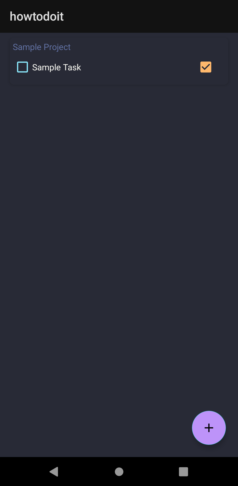

# About howtodoit-android
HTDit, or howtodoit is a simplistic todolist app in Java and SQLite native to android.   
Swipe to right to Edit, swipe to left to Delete.   
Dark theme only.   
# Some sample screenshots of this app running on baremetal pixel 4a.

